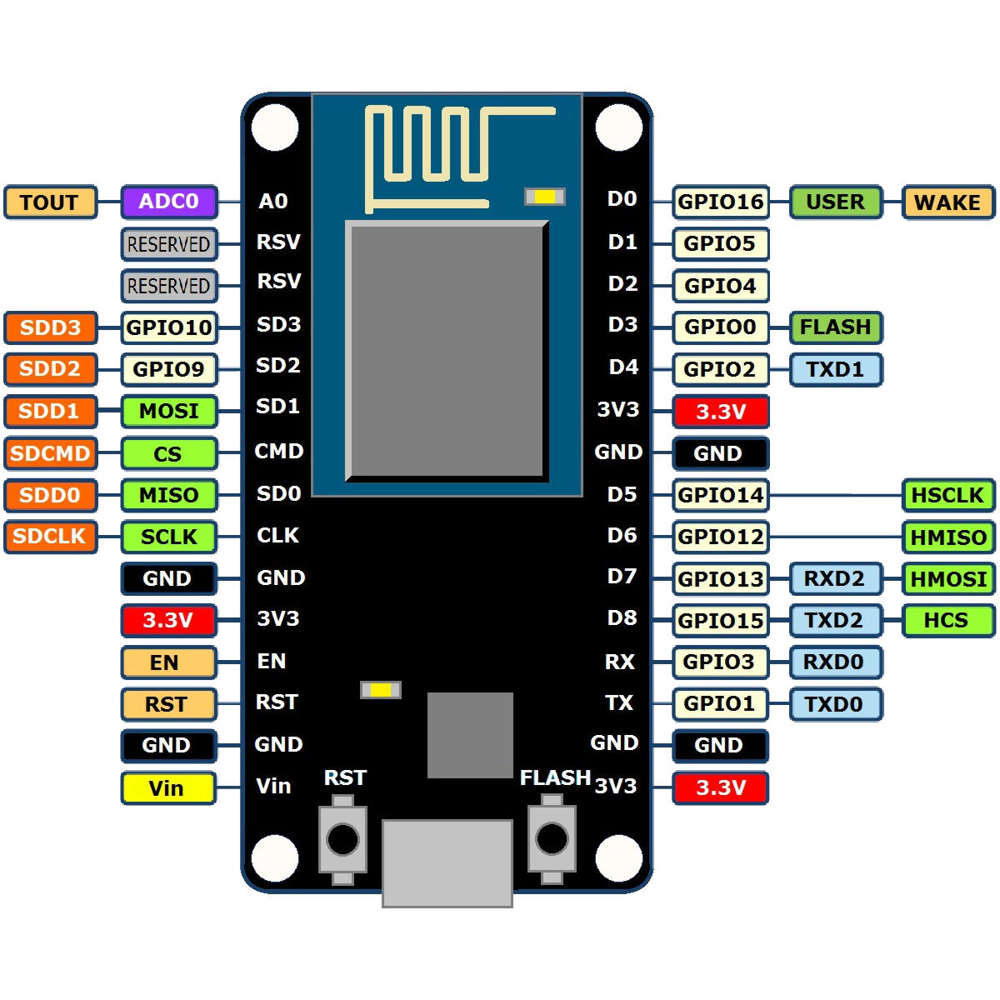

# [NodeMcu](https://github.com/nodemcu)



## Instalacion del firmware
1. Descargamos el archivo: 

	```
	$ wget http://micropython.org/resources/firmware/esp8266-20190529-v1.11.bin
	```

2. Instalamos con esptool

	```
	$ sudo pip install esptool
	$ esptool.py --port /dev/ttyUSB0 erase_flash
	$ esptool.py --port /dev/ttyUSB0 --baud 460800 write_flash --flash_size=detect 0 esp8266-20190529-v1.11.bin
	```
## Acceder por terminal
1. Conectarnos por serial

	```
	$ sudo apt install picocom
	$ picocom /dev/ttyUSB0 -b115200
	```

2. Ejemplos
	1. Libreria para controlar las conexiones Wifi

		```
		>>> import network
		```

	2. Levantamos ambas interfaces
	
		```
		>>> sta_if = network.WLAN(network.STA_IF)
		>>> ap_if = network.WLAN(network.AP_IF) 
		```

	3. Ver la situacion de las dos interfaces

		```
		>>> sta_if.active()
		False
		>>> ap_if.active()
		True
		```

	4. Habilitar las dos interfaces

		```
		>>> sta_if.active(True)
		>>> ap_if.active(True)
		```

	5. Ver los valores por defecto 

		```
		>>> ap_if.ifconfig()
		('192.168.4.1', '255.255.255.0', '192.168.4.1', '208.63.999.999')
		( IP	      , Mascara	       , Gateway      ,  DNS	 	)
		```

	6. Conectar nuestro interface Station a mi red Wifi

		```
		>>> sta_if.active(True)	# Activar interface
		>>> sta_if.connect('NOMBRE_WIFI', 'PASSWORD_WIFI')
		>>> sta_if.ifconfig()	# Muestra datos de la conexión
		>>> ap_if.active(False)	# Desactiva el ap interface
		```

## Programar MicroPython por medio de un archivo
1. Instalamos ampy

	```
	$ sudo pip install adafruit-ampy
	$ sudo pip3 install adafruit-ampy (Opcional) 
	$ pip install mock
	```

2. Creamos codigo python: ``test.py``

	```
  	print('Hello world! I can count to 10:')
	for i in range(1,11):
		print(i)
	```

3. Corremos el codigo python

	```
	$ ampy --port /dev/ttyUSB0 run test.py
	Hello world! I can count to 10:
	1
	2
	3
	4
	5
	6
	7
	8
	9
	10
	```

4. Si no queremos que muestre el output
	
	```
	$ ampy --port /dev/ttyUSB0 run --no-output test.py
	```

5. Boot Scripts

	1. Escribimos el codigo

		```
		import time
		print('Hello world! I can count:')
		i = 1
		while True:
			print(i)
			i += 1
			time.sleep(1.0)  # Delay for 1 second.
		```

	2. Modificamos el archivo ``main.py``

		```
		$ ampy --port /dev/ttyUSB0 put test.py /main.py
		```
