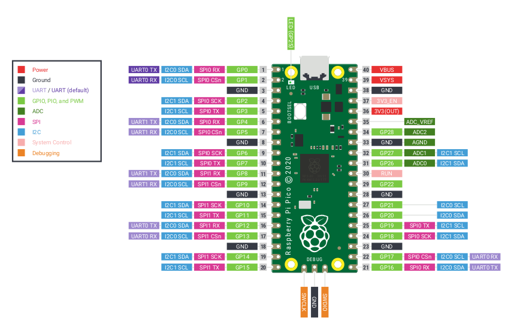
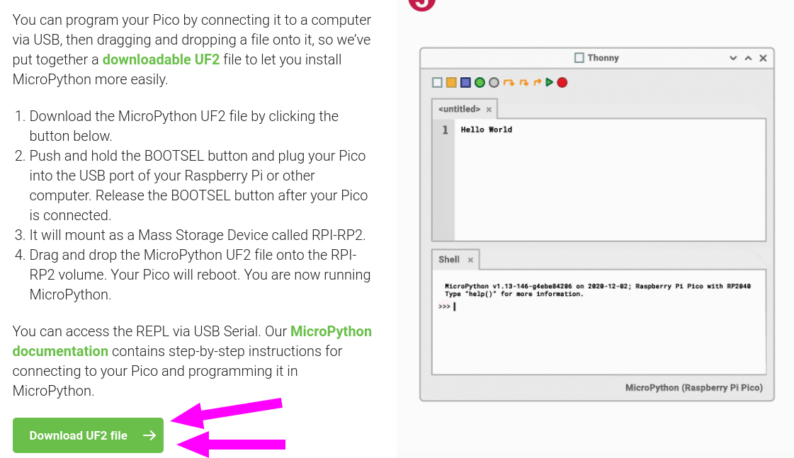
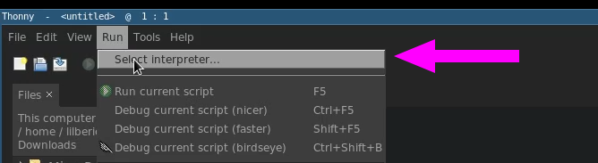
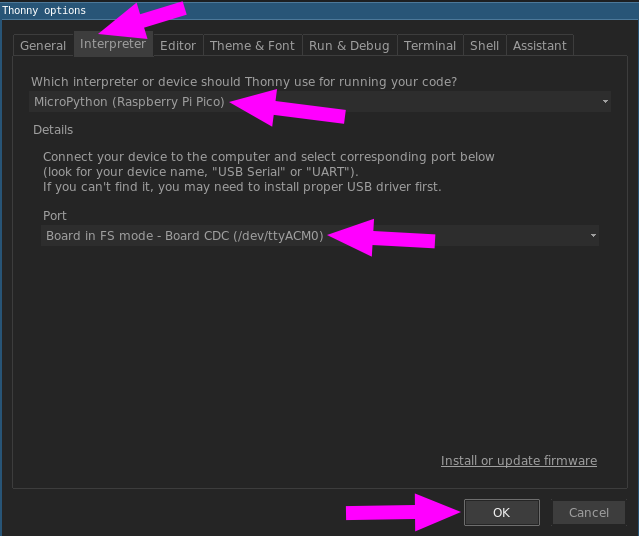
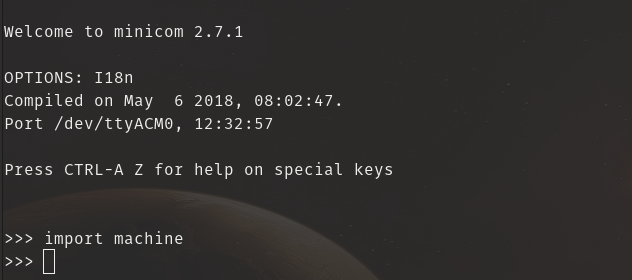
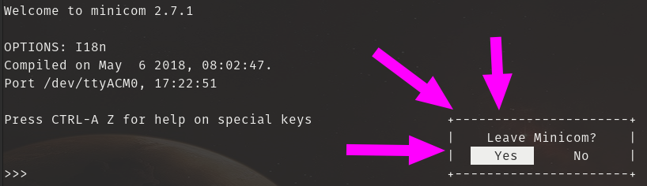

# [Raspberry Pi Pico](https://www.raspberrypi.org/documentation/rp2040/getting-started/)



## **Habilitar la Raspberry Pi Pico para Micropython**

1. Conectar la rpi pico por usb a la compu

	

2. Descargamos desde la: [documentación oficial](https://www.raspberrypi.org/documentation/rp2040/getting-started/#getting-started-with-micropython)

	

3. Copiamos en nuestra Raspberry Pi Pico

	```
	$ cp rp2-pico-20210205-unstable-v1.14-8-g1f800cac3.uf2 /media/TuUsuario/RPI-RP2/
	```

## [Thonny](https://thonny.org/ "Python IDE for beginners") : Python IDE for beginners

* **Instalación**

	1. instalar

		```bash
		$ bash <(wget -O - https://thonny.org/installer-for-linux)
		$ ls ~/apps/thonny
		```

	2. abrir programa

		```bash
		$ cd ~/apps/thonny/bin/
		$ ./thonny
		```

	3. desinstalar

		```bash
		$ cd /apps/thonny/bin/
		$ ./uninstall
		```

* **habilitar Thonny para micropython**

	

	

## Minicom: Conectarse por serial

* Instalación

	```bash
	$ sudo apt install minicom
	```

* Comandos (Ctrl+a+opcion)

	```bash
	| Dialing directory..D  run script (Go)....G | Clear Screen.......C |
	| Send files.........S  Receive files......R | cOnfigure Minicom..O |
	| comm Parameters....P  Add linefeed.......A | Suspend minicom....J |
	| Capture on/off.....L  Hangup.............H | eXit and reset.....X |
	| send break.........F  initialize Modem...M | Quit with no reset.Q |
	| Terminal settings..T  run Kermit.........K | Cursor key mode....I |
	| lineWrap on/off....W  local Echo on/off..E | Help screen........Z |
	| Paste file.........Y  Timestamp toggle...N | scroll Back........B |
	| Add Carriage Ret...U
	```

* Conectarse por serial

	1. Damos permisos y accedemos

		```bash
		$ sudo chmod 006 /dev/ttyACM0
		$ minicom -o -D /dev/ttyACM0
		```
	2. Esto aparece inicialmente

		

	3. Presionamos **Enter**. Ya podemos empezar a escribir código Python

		

	4. Para salir: Ctrl+a + x

		

