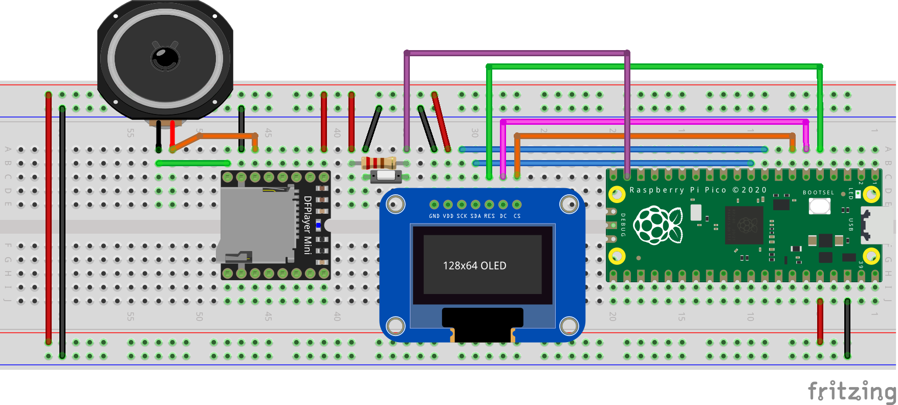

# [ssd1306: oled 0.96 pulgadas (128x64)](https://docs.micropython.org/en/latest/esp8266/tutorial/ssd1306.html)


## Conexion SPI

|**SSD1306** 		|**GPIO/pin(RPi Pico)**	|
|-----------------------|-----------------------|
|MISO,CLK,SCK(D0)	|	6  = 9		|
|MOSI,SDA(D1)		|	7  = 10		|
|DC			|	4  = 6		|
|Reset			|	3  = 5		|
|CS			|	5  = 7		|
|gnd			|	gnd		|
|vcc			|	3.3v		|


## Convertir .mp4 a .pbm (obtener carpeta: imagenes)

```
├── convertir.sh
└── video.mp4
```

1. Ver fps de: video.mp4

	```
	$ ffmpeg -i video.mp4
	```

2. codigo: `convertir.sh`

	```bash
	mkdir imagenes
	#MemoriaRpiPico_aprox=1.2MB, Peso_pbm=4KB, imagenes_pbm=1.2MB/4KB=300
	#duracion_video=30seg,imagenes_pbm=300, fps=300/30=10
	ffmpeg -i video.mp4 -filter:v fps=10 output.mp4
	rm video.mp4
	mv output.mp4 video.mp4
	ffmpeg -i video.mp4 imagenes/imagen%d.png
	mogrify -colorspace gray imagenes/*.png
	#mogrify -rotate 90 imagenes/*.png #Usar si el video es vertical
	mogrify -resize 128x64 -quality 100 imagenes/*.png
	mogrify -format pbm imagenes/*.png
	rm imagenes/*.png
	```
3. Ejecutar

	```
	$ ./convertir.sh
	```

## Micropython

```
├── codigo.py
├── imagenes
│   ├── imagen001.pbm
│   ├── imagen002.pbm
│   ├── imagen003.pbm
│   ├── ...
│   └── imagen300.pbm
└── lib
    └── ssd1306.py
```

* `codigo.py`

	```py
	from machine import Pin, SPI
	import ssd1306
	import framebuf
	from time import sleep_ms
	import os
	spi = SPI(0, baudrate=1000000, polarity=0, phase=0)
	oled = ssd1306.SSD1306_SPI(128, 64, spi, machine.Pin(4), machine.Pin(3), machine.Pin(5))
	oled.invert(True)
	numero_imagenes=len(os.listdir("imagenes"))
	def Abrir_Icono(ruta):
	    doc = open(ruta,"rb")
	    doc.readline()
	    xy = doc.readline()
	    x = int(xy.split()[0])
	    y = int(xy.split()[1])
	    icono = bytearray(doc.read())
	    doc.close()
	    return framebuf.FrameBuffer(icono,x,y,framebuf.MONO_HLSB)    
	while True:
	    for i in range(1,numero_imagenes):
		oled.blit(Abrir_Icono("imagenes/imagen{}.pbm".format(i)),0,0)
		oled.show()
		#fps=10, 1000/10=100
		sleep_ms(100)
	```

## [Thonny](https://thonny.org/)

1. Subir los archivos a la Raspberry Pi Pico  

	

2. Ejecutar  

	

3. Resultado

	

## Por si quieren agregar el audio de la animación

1. Extraemos el audio del video
 
	* Puede ser en formato .mp3 o .wav

		```
		$ ffmpeg -i video.mp4 -vn 001.mp3
		```

	* Coloca este archivo **001.mp3** en una memoria microSD

2. Conexiones (Introduce la memoria microSD en el DFPlayer Mini)

	|**GPIO/pin(RPi Pico)**	|**DFPlayer Mini**	|**Button**		|**Resistor** 		|**Speaker**		|
	|-----------------------|-----------------------|-----------------------|-----------------------|-----------------------|
	|	3.3v		|vcc 	(pin 1)		|			|pin 2			|			|
	|			|SPK_1 	(pin 6)		|			|			|pin 1			|
	|	gnd		|gnd 	(pin 7)		|pin 2			|			|			|
	|			|SPK_2 	(pin 8)		|			|			|pin 2			|
	|	14 = 19		|IO_1  	(pin 9)		|pin 1			|pin 1			|			|

	

3. ``codigo.py``

	```py
	from machine import Pin, SPI
	import ssd1306
	import framebuf
	from time import sleep_ms
	import os
	boton = Pin(14,Pin.IN)
	spi = SPI(0, baudrate=1000000, polarity=0, phase=0)
	oled = ssd1306.SSD1306_SPI(128, 64, spi, machine.Pin(4), machine.Pin(3), machine.Pin(5))
	oled.invert(True)
	numero_imagenes=len(os.listdir("imagenes"))
	def Abrir_Icono(ruta):
	    doc = open(ruta,"rb")
	    doc.readline()
	    xy = doc.readline()
	    x = int(xy.split()[0])
	    y = int(xy.split()[1])
	    icono = bytearray(doc.read())
	    doc.close()
	    return framebuf.FrameBuffer(icono,x,y,framebuf.MONO_HLSB)
	def animar():
	    for i in range(1,numero_imagenes):
		oled.blit(Abrir_Icono("imagenes/imagen{}.pbm".format(i)),0,0)
		oled.show()
		#fps=10, 1000/10=100
		sleep_ms(73)
	while True:
	    estado = boton.value()
	    if estado == 0:
		animar()

	```

4. Presiona el botón y empieza la animación con el audio

	
